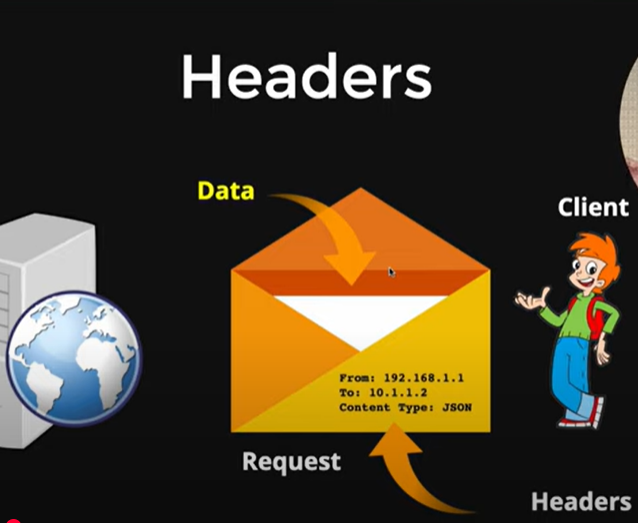

# Backend Notes
- Node js is runtime environment for javascript and this is where we run our script
- `node -v` and `npm -v`- node package manager
- `npm init` to intialze and make package.json file, `npm run start`to run specific script file
- Js only execute in browser
- with require method we can import
- `npm i nodemon` - `nodemon index.js` use nodemon to avoid restart server it will save eveything in after changes

### Architecture
- Whenever a client sends a request, it goes into the Event Queue.
Then, it is picked up by the Event Loop.
The Event Loop checks whether the operation is blocking (synchronous) or non-blocking (asynchronous).

- If it is non-blocking, the response is handled immediately or passed to background APIs, and the Event Loop continues.

- If it is blocking, the Event Loop sends the request to the Thread Pool, where worker threads handle the task.
Once the work is finished, the result is sent back to the Event Loop, which then sends the response to the client

- always write code in non-blocking

### Http Methods
- Get - when you want to get some data from the server
- post - when you want to send and mutate some data in server / sending a sever (like sending user information to server through form, username and password and it make post request)
- put - put something in server like image
- patch - when you want to change something
- delete - when you want to delete something 

### Versioning
``` Javascript
"version": "1.0.0"
```
### Rest APi
Json format is restApi in simple way
1. always respect all http method

### Middleware
- client did get request then express server will send response 
- client - middleware - server
- first request will go to middleware (middleware is just a function), then middleware do process then check eveything whether is it hacker or not or another shit if eveything is fine then middleware send request to server if middleware feels anythin is wrong then he will return the request it will not go further to get respone and it will end the request and respone circle

- - When a client sends a GET request, the Express server sends back a response.
- Flow: Client → Middleware → Server → Response
- Middleware is essentially a function that runs before the request reaches the route handler.
- The middleware processes the request and performs tasks such as:
- - Logging, Authentication, Authorization, Input validation, Security checks (e.g. blocking potential attacks)
- If everything is okay, the middleware calls next() to pass control to the next middleware or the route handler.
- If the middleware detects an issue (e.g. suspicious activity), it can:
- End the request-response cycle early using res.send(), res.status().json(), etc.
- Not call next(), which prevents the request from reaching the actual route.
- In summary, middleware acts like a gatekeeper between the client and the server logic.

### HTTP Headers
- there's addition information (meta data ) or address in headers
- header is extra information which tells about request and respone 


### Status Code
1. informational responeses (100 - 199) 
2. successful responeses (200 - 299) - means everythig is okay
3. redirection messages (300 - 399) 
4. client error responeses (400 - 499) 
5. server error responeses (500 - 599) 

### MongoDB
- It's a dabase
- no-sql Document Based Database
- - there are two types of database one is sql which works in sequal way like on tables, and no-sql works with document based Database

- Strong Support For aggregation Pipes

- works on BSON format - like json - store data in bson format
- Best for node js application

### Architecture
- MongoDB has a collection and in collection it has document like in sql tables
- eg. Collection - "users"

#### few commands
- show dbs - show the all database
- use <db_name> - switch to database
- show collection, db.coll.find()

#### Schema
- in schema we define the structure,
- using schema we make model,
- using model we do CRUD structure

### Model View Controller
- Model - view - Controller
- controller manipulate the model, and mmodel update the view
- in this we make folders like controller, models, routes, maddleware
- always make folders for production it's help us to make clean view